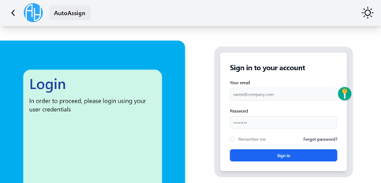
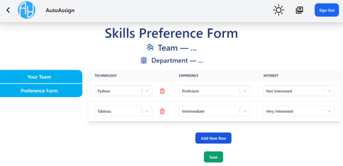
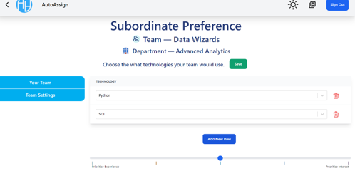
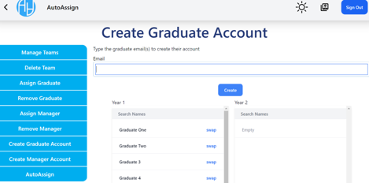
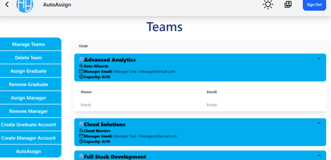
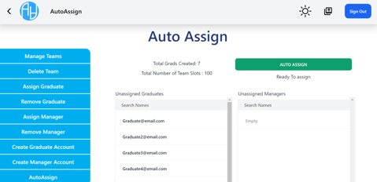
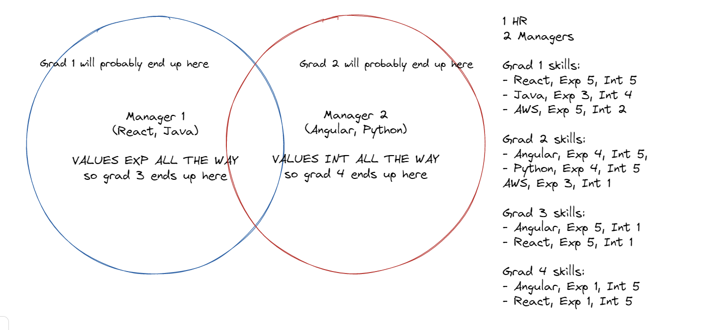

# Table of Contents
[[_TOC_]]

# Authors and Support
Members  
Naral Chalermchaikosol - 2783720c@student.gla.ac.uk  
Max Wang - 2561238w@student.gla.ac.uk  
Vaughn Muirhead - 2575235m@student.gla.ac.uk  
Binhao Li - 2534558l@student.gla.ac.uk  
Prith Manickam - 2518533m@student.gla.ac.uk  
Hugo Findlay - 2554911f@student.gla.ac.uk  

Team Coach  
Tim Storer - Timothy.Storer@glasgow.ac.uk


# AutoAssign - Project Summary
Auto-Assign is a React-Django-based website to automatically allocate graduates into teams for a 2-year graduate programme. It uses an algorithm that best recommends graduates to their new teams during rotations. The types of users that would use the website are Graduates, Managers, and HR.

## Visuals

### Video Demonstration
[Click to view YouTube Video on our Demonstration of AutoAssign](https://www.youtube.com/watch?v=nJ5digCqdAM&ab_channel=PrithManickam)


### Screenshots
| Login Page | Graduate Account: Preference Form Page | Manager Account: Teams Settings Page |
| ------------- | ------------- | ------------- |
|  |  |                |

| HR Account: Create Graduate Account Page  | HR Account: Manage Teams Page | HR Account: AutoAssign Page |
| ------------- | ------------- | ------------- |
|   |    |                |


## Roadmap / Releases

### Release 0.1 – November 2nd 2022 
- Notes: Only blueprint documents - Wireframe and ER Diagram
    - [Figma Wireframe](https://www.figma.com/file/AH6i7Z9b0IayMIizR5B4XR/Final-Frontend-Prototype?node-id=0-1&t=Ognts1usday9kdrA-0)
	- [ER diagram (outdated version)](https://viewer.diagrams.net/index.html?tags={}&highlight=0000ff&edit=_blank&layers=1&nav=1&title=ER%20Diagram.drawio#R%3Cmxfile%20pages%3D%222%22%3E%3Cdiagram%20id%3D%22R2lEEEUBdFMjLlhIrx00%22%20name%3D%22Page-1%22%3E7V1bU6NKF%2F01qTrfgxaXXPRRo9E5xpkcdUb9XqweaRNmgM4B1GR%2B%2FWkIRELvIATCpZspayqQTofsvdiru%2FfqTUcdmosLG81n10TDRkeRtEVHPesoitxVlI73J2nL1ZlBLzgxtXUtaPRx4lb%2Fg4OTUnD2VdewszoXnHIJMVx97mx8%2BplYFn52N84h2ybvm81eiLH5rXM0xcyJ22dksGfvdc2dBWfl%2FvHHG5dYn86Crz5SBqs3TBQ2Di7bmSGNvG%2Bcwgt3RCw3uMQJtk1kYcul71wj%2Bze2O73zmet6v%2FSko4zo34vX%2BnBKyNTAaK47h8%2FEpKefHdpk9IJM3fDMHOnoNOiIfp163lGHNiHu6pW5GGLD81XohtU1jba8u7aD7fWb4gPDg7fl%2BLfkWpfv6g%2F3%2Bno6Gfw8CHp5Q8ZrYN%2FANu4yNDjWqP2DQ%2FpVuru8wQZydWKdf7xzii3txPMubXR%2BQyzvlOMi2%2F04SS2wXDUc6fTC1DMpbBM5pl9gLx%2BiB4%2FewWEvPDxbRN88WwZHrDGCX%2BaQV%2FsZJ1hA6QYgRvYUuwkN1QAi2gY%2BA1tfYGJiekG0wXsElVKAq1kEkOuTtm%2FGt01cowB703WH6%2B%2BYEN2HYnArq92gn%2BBG7h9Lm12sfnrwqSgwYh11Yx314h2tTMN0RF9EfvjHKR93WTColAfC1cm6YVBNCUG5WzMMdqVN6Mi9XTHYj3U06JWKQRaC18iiTGI7DBQpbcy9ly76aawRFvCk6uGAMp%2BLdIsGefVM9o8NA80d3W%2B%2BOjPTDW2MluTVDTsKj05f9AXWblY06bWlyB3TzpwAZB7hhDeC9zYy9KlFXz9T0HnfeGpjh17LGDlu0GIrLN%2Bw7eJFIo5C7xxvemcQHEZgpvQgmMUjSRRRGy7M6i%2F185AR%2Bon%2BcldHxg0djCBr6rts0yOeWTWbzO%2FC2887MfeQhu3zN7waDvi2pzFiSAziOdZaRRK%2Fmf%2Fjeqf0j%2F7coRcoevQChvRY%2Fjimf15z2x0Sy3FtpPvewNRP79jz1alL5sH3GPglvAw7MKb3%2BidxXTq62ObVRFx%2F7urAtWpK16r78myX8ezkKotvCf2tL4Yf7me6pmFrdUd6Y1H04W%2FAlaD91zaPOyN%2BH6b0h5raHxEHqBntH3T2YZXMvSGDYt9CLj4lr5bm7CPi9hg%2F0wHi0xetM1Q6J9Lq%2F1N9evLqEtrs67c77%2F%2Fv43ENsRDG4FXbU2eOnnVrOl59sl8GWBadrTevUih4UnVXAnqORY7%2F8GCzmPjfrzr%2Bh%2BsMEdeOruQs3i3prk%2FpgePUHuA94svsYoOGPf890Y%2FRz%2FrzgWYH%2BsIxwXNgt%2BXz8YOMyTd1%2Fh1NfnSvv1i3wLBgKw581954Tj%2BdEVv%2F4027Nub0waTMP37XTQNZ%2BBIjLXbqlGjL7QBJSxU8ccBxSg5QCuAAEAT9nOxe%2BI2PNT3sT94SblhnJOI7Nx0kGT87HcR7K%2BFOHzBOftFtx32ykOld8PMM2X%2Bp0v925oQq4n8pwMjICbsDJVV3xSLl4G958Ti4e7tUiGqOF%2BbFEN8fKBniQUsKeyIFWS6RFWAYsBGjibSQDHGheAE2xRHjZm9lCJtIN0JekCUuiSEvNHhmBu3OPvtnbM7%2FvXuZvI%2FuJ2d9aQSMIVpiKJ0YykwZgChgA0bF4SC63iulvvsTES7U8hFoCXbJ18HUd1qjJwyVIEW4RaUMAaKliX3RRJmZBRAFeXNG9Zg%2BJAJcKJYALQGkj%2BbIcd6JrYUc0W8YR5SCC545QVUuvku6ea7cn3zrfhvhyb%2BL87WWbovIkMbTGZkSCxlRgaHtXQ7Wwht23WZMfJd7J39h110GJIE88QIlEtc0gnfxQnd9aeFKTUiPHiPvfAgLvYOQQNZ6RLkT1SN2ktWIoPCRlTpuCibvyDWk0vV7nmBbp0b3ZW0wUaSVO8qA3tF4MGfSL%2FnXMZ6gwfE5Hjrdrwdp5Y7ZVIz0F6NlpEFAtR89x7SJsiQFi7OhRmoQU1rHPnAUU0Vmbd%2BTpRjiV5dcbDaWldCd%2BdlYEwfWEF31eHS0o%2BoxLoItThvBiuOykVejZS8ZlFNyeulUXXSPMpv55kn4uIauUENU2BRsOkvD81b6uCNceB65wlNvdoojEAtkWKPIzgKVqx8VViNXw7s%2Bpf3XQG1jfuhGVvsYXb3OldasS8QvHhw8R%2Fgn9Wo%2BHT7eyfL9r9%2Fkbvi0vHk8UNsF6xqQQVoZZBFkAMOAjxXrZIgLxQ2gKbrseM56NZ%2BwOTeI9%2FvzCOPru16dFxU8kwK4GNpqXWrACbJSIimAMKid2GUnTkhEuFCUAFqCJX4NO8%2B2PvcqXoSzhZ4%2FW%2BCBC3KigWcqgHOX7H7IynKX63Rlcu4yUj5lh%2BxlUDvos%2FRlJ564ZKGWuixQ6posaesC7TlJeRTLUSanHNmcZrEpR3B0Jx9XC9tBlpz7GlnW1ppBn%2BIzP%2FwKRhVbdyeMXiEMjmLRbEvdnazwVLpHm9%2FzSUqcua5BsfhMNHqEdi9spL3SWN4mxDsfq%2BMZ8%2BHrz6Uk3PBaeptfBw29weJWVSzvton5lKu%2BzUvMK3wn5pU2Mb82BZuYn9L432bmd8QLz%2FMy2DZ5d6g2mgayZIYbmJlnF94aXZdIEXK1DTYFu9xW7I7jOoZ8qXic8BzvwXU4tS1MUQNqKDNPD8OApf3RVdVpmd12libDXCiqgE3BjgJcjMz8Feyqp4OyICIeS2SQ8bQssS%2BWKDVzD%2BIA0PmMrlSOaELIUqewq%2FdX6rTpRNHWPvV6gys9tRs79hb9eyVGf9i5Dd3ZkYxUoUI9bAqF8aufNBBu9SgvUHgO96NL%2Be%2Bvkx9m%2F%2BrFvry6s5ylep%2Fm2WvttGDvxHCUkhiKKGsKwoCNHxUPB3cS9CYiXKiipqAlWGWRKMWucwKD55KmoGkyKIlaVtgXKyhSidMFEAYZnoPRNFYQUnAEWoJNH3JQ0rQUZAg3WWh3%2F9WBFsoUo4Iw4GP3XyLCW1pg84VilDDNCQueOQHeBthj%2FN6wbYDriqapi5iuK5TuZy8gbOdVu0%2B3AgaxuLg9W7mqh8iDKtFxIB1KUjcKkENJVT8BSaY9d1sq2tIed6pUW2IB2tS73YrehRf%2Fnl6wkbioXXVJd0%2BEze4wMtsNdZ4%2FjmN%2BT%2F3kRbmAASborbyr0Y1OQcNuTUR1LfexwcoLxrMN3caWiFuhZg%2Bw9ojxs69QFXUTW060CDepyLvw3GgCgEeLxRBAmTvYwCtmV5ubsoEtEahtxGfXhosSm9YlzBcOCZ7DOjiTbcVG1TNAmRvVQBCwk7um7lNLxLhQjABagp3rNf8RypUARTieaOVH1fNE9UVm%2BVAfJQK8JQl2PugvFBX2QIr6JppzAoNnUgAjWF7VSbsmVIdtaeAl53vERL1WhIR8pAQMRHYn6dwm1A%2Fe5f5yiPWiY0P7q%2Fl70gpHBs%2BxnQy%2B4Lc%2Fb5jGwe7s7c%2F5P6ZiZxnqtQP%2BfdFA2k1oRdAAiIIMhaxqPOBPBLhQrABags0T2MjVvSSwRl6prXPwQX3H%2BjkxwTMfwMGLHexf3iRTQkcIsVb8ceCpxVpyXM2Xrv75IPZ9PWCu0K8JZvI%2BqK7RE8QsqrH0A9G6yMaAojQ86cbW0BVqeAB7ms0Rz2wBdGO9vaCF54GDLZ%2BPH2RMvqnz72jyo3v9xbo96LNJx%2BRhQzuT3ANflKkyg2GQ91Eo9ZhKJkNcKLKATcGuG4mxSTEvMHjmBbgEWFv%2Btga8UKb2DISBys4jmsgLyRAXihdgN4OTiGYrz8pBBs%2FEAJJmr61pUgNiKFVsBuOgdkVNdpOaJoNcKGqATcEOBDkod1UNVoQji36G4WNLFnsji7R6tSKq5cI4yFdGvS7TiGSMC1UvFzaFwrhZlIK5eaHBc8VcuNBRn3E8Z2WwPq1tlao0Egs1oAwSbOFVu88LYAXLoOVXwHp4vLCmw%2F8TIt8eyNdD%2FeHLtRbugtsRF1KRuJB3woX0CS7SVcSKgsdcFU%2FboTJaWmCAyyByVbhIuuroNlhitxWpvHdDntmhINWhFPkXRoLCfdfKlfOIkhJvh1pqksArZtXK2SRJJciP0o31EiGeaRaQRgmYfmhXvq4QtAS7QPxCA3XBkqSqF41KQ0ssxEfcLR8Xip5U3ZWRi2r3Le6JAcpUGcGuZdeSm1LMKhmqQgV90BTAY3L9B%2BpxXMwqLyR4juxgwMoQ2IWeBeyTA8pUFIFXDFFAI5MBiRAXihBgZLKE4PymjvLmAc17lnYpkBCOEOS2vmH1jFCqlAi%2BZDZtyA0hyOn9wT0jsFuN8GKObR1bz3jFCVzuZc%2BLC55pAS702KqGakALZRa5gmHAh2goGeJC0QJsCpb9%2FeVZ72bglxTyooJnUoAX1toccg1IocySVzAM%2BKh5lQxxoUgBNkWGXUaNivt5Hc9z3AdjVLfdb5Yn7meeZg7CulcJBazKDfnsNODWW0hulX%2BROBBm%2BNM6az27K9xbGdbyhL5dYQAk3gC1lPrBhMaAoKFSv0SIt8M0tmrQOscnpNYvJ1x4HtyBpmnn9HnGdsWQReWqQI5n9O2EPrQEO4vzB%2FEbO0N7XO4MzQkM4TihVQlWzwmV1x3LW5q6xpwgpEQQhmWGPH%2FzQ36rA9wOhFYHWH3ML1UHCF9yhrXDpkV9MXWAsCkylBxvftgXU%2BhHD21C3GhzG81n10TDXov%2FAA%3D%3D%3C%2Fdiagram%3E%3Cdiagram%20id%3D%22_GLcHVwk1HqD0G9qDUZH%22%20name%3D%22Custmer%20Page%22%3E7V1vk5o4HP40zty96A2C4O7Lqrvdm3Xbm%2B327vpqJ5Wo9IDYELvaT38JJIhGFERACTP9IyEEyO%2Fh94THJ7FjDL3VBwwW8ydkQ7ejazPs2B1j1NH1Lv1LCxZgBrcKWI3Pzi9RqPHSpWPDYKsiQcglzmK7cIJ8H07IVhnAGL1tV5siV76MzxPgQqn0H8cm86j0Ru9vyh%2BgM5uLE3Wt22iPB0RlfuHBHNjoLVFk3HWMIUaIRJ%2B81RC6rGdEv0TH3afsjS8MQ59kOeDzu493N0%2Fvf3z%2F%2B8PDaPp09%2Bm%2F6Y93vJWfwF3yG%2BYXS9aiB6BNO4Rv0lM5ZP0MXUAc5N9t9gygb79nvUsr3T0jnxUFBGCyKfSAv44q3jv0woyRJuoktukJ8Prf5MZXtvGHKTZHq%2BTO0ZpvRVfNLjW1d3hRgJZ4Ag90iWFyVAE8g%2BRAxV4cRAptiDxIL4ge97aBSVfjsZ8nISIKcdiNP7evGHB4zuIG43P8hRx6L7q2imroPd7OOtq2brXtJqI75UclgbHTkLHTkLnbUNQTUkP0Q%2BLGN0Uh7nJgUK8Og1HhxUOwlxGBes0QNLRt5HTNUyFo7TTUNyuFoCFB8An4NLXjQIIiTeML9pGAb26MME5TBsMBJR4CHB9iWtANt10XLAInrB6VzB3XHoM1WhLRkNgaTJ0VtJ8jlmJ1KXLHtLGAg2xKGxcPAtsNXGfm088TijF2xgGGAb2WMQgIr8HvDGICV4eBKeMoJToiPyRgppt7YBZz9j5EbYUwb7x6x1OGiBO9TeIA95mOBYA%2FC0O2HRHWrTZGixfxtLGCBUMaxHc%2FaRfFfU9zxBC5iAXWjzJJWC28OXNA%2F9DbHbJEYdILGNLt7mab%2FmHVMRkiPyAYOGHXQxqnN8hiNSBowc%2Fjwqm4DMw7k33%2BhghBXp6opkNdDvVaPNHZQmuUFVlTiuxfj3lii2ifTN0w3c8d24Z%2B9ESyoSDYxHtPKPf2f9znu8HYfQ5Pj8fxFG7k7H%2Fe2KZXcrcGXIp9HxA4QEvfDsrIuJYUZzo%2BfIUecNihkznAv1GW%2Bp1%2B%2Fvjphf37ZTy%2BQByI%2FBvVHQQLMHH82Tg60qoCKKtO6oOrnxU4mZqrADl9lXO%2FVmLut%2BrO%2FTdSZO8fu3mCW9FDf3oA%2Bmom%2B1spsDMM7Fd6TJNS%2FdlhoVxqF%2B8LbW4%2Fd27P%2BspWWm7vykrj%2FWOu6F58cu9q%2B0PQ9OzelQU8G7IAtgn%2BGDTUy%2FCy0paKhDC4zyzsgznCzi%2Bmq22Jtlx1C7ffHM8FPnyAwN4pGiB7nQ6RrJzRJDLo6hnZQC%2BNDWQB7%2F7RyMf1Z3%2F%2Boe2I9ropWadABkgJyZF0figC%2Bclht7UqHnhZ0Js6OCCvPvCgYAejADnUQQTVQCMnOZwOlUzNVYEVWRRsyaFycujV%2FqogK3z3j72ac0JSx9XOnwIsRV8dZMnvi%2B%2F8WMI%2FR5fOAfUAQr0XBlk7bDmhck7o180JAo0nK4NX9rZwqyYf6LJKGEAaPLt9XTiKDeWoYU8KSPoEaVadoxnygZv0CGJ2OdAWT21cZ4zCmLPC75CQNacKsCSI0QnxXL4XrhwSugMjQyDd%2BprYs%2FEGsg1BI7GlsNvJZSnc616U%2FYrbrscX9LTPaRv11VnsiTpXao76E82b%2FVDNbDssxhmy1jgKdWkv%2FPLn4Ciio4SxzxK8nvNbom55PN86%2B04mBv3CrX26ct6%2BDP7sZg7jZCFv843gUO%2B81yL3d3IIp10gEip096VBRb1RXevvK4sBajf46c13%2BOmKWvx0WadD2IY48oDI6f7iQl6i%2ByMNE8rldnHKNrefPbfXbvAzMkwlrv8pP73%2FDUXdfYYuxTWYOwumobza9Mx0F%2F9P1fSehgz10rvs4KpNkI012MOCbEKD%2FZrcl02Q5UsaHFNky9RijcxzxVP4I98UcHpfYJ2owIl00%2FLOxO54IjenKS44ps0D798eqk4%2FROc%2FL2plyfEDBvaSPiqtSNzZjCLyTv7u5ctn4vJ2TrfPq7p3TYM68p0saCo0nC04DT1F77oUsdqQJcyGi9URmhUc4MqCYzg7sZ2Lnh8r6g15ZUVTIQoo%2BEZ9mAJqV6sNWdJsmlptpBg0mp7zxdhUqeVHtPPjRLl838uhcrZ25LKooXaxuyeLojlns1%2FdFJVeikrQeKqQXYQEAq%2F495r100FVEFGPJXK4GFuWKIslMk9zL48mZIGw%2FmnuJecARS2PvUOWx5YosoFEPaLIYXZsiaI0ojAzEkVp66H0isqI1zW9sXeaSfLqF0PpyYpiuxhKNmgotxiKyD8tNdRKDbXPfDeL%2BSqvjRpMRW2WpqwotjPfM2JDudcGs11F8QK4Qddq54ais6WvjBtOW0Px%2BrlBlhEXIAjeELYFMVhqE8N5VlBsADFYUuCvzIEfr5CSeUmUeL2TOm34Jhfyjtrwi7rwi%2FGFLDe%2BQOC1Nnf2tO78yJmR1YJc3mIoptLmwmIOVTNFR7oUf7kpS4EN95enLQbV9NGbyCt7DCTtUih5gKLcaM4qKv1ddf4v9u5%2BJP%2FXbi63ZL2vaeZyS1HHoCWrc%2B1SKEcwoV5uV3qhw1Jze%2B3ucKvYvODLT%2ByKevws2ePXLoWSCRnqpfe%2BFPgqhdikDBuLsmULscckWK%2FkZamFXHZcg01BaTUirCWreg%2FPqWlCYQXWzPr9ankKrJXj10eaN0orJuNYKTLOpSiwwtmljgJrKfqrIn1ZR5vjhk%2F2NktBinLjuL4s0ylEAAVfEw8TQO0SbF%2FW6ZomwUbwVTDjy%2BpaK8EewYR6uV3p5ftKze21S7D9HD8lfJWJXdHF%2Bvqyg62VYDMho0HpnW5ihEiyOgaL%2BROyIavxPw%3D%3D%3C%2Fdiagram%3E%3C%2Fmxfile%3E)

### Release 0.2 – November 30th 2022 
-	Repository at this stage: https://stgit.dcs.gla.ac.uk/team-project-h/2022/sh23/main/-/tree/e6444f97d4ca3fe31c020fa5479ca0eebc1296c8
-	Notes: Frontend and Backend not connected. Only Frontend UI is usable through routing.
-	New Features
	- Navbar: displaying Logo, AutoAssign Name, Avatar Icon
	- Login Page with no authentication
	- Forgot Password Page
	- Accounts Page: Contact details page
	- Graduate Account: Preference form page
-	Known Bugs
	- Avatar and Sign-out button shown in unauthenticated screens

### Release 0.3 – January 17th 2022 
-	Repository at this stage: https://stgit.dcs.gla.ac.uk/team-project-h/2022/sh23/main/-/tree/ea2c5f1bc43492f90baef1c63e4691d7967b370e
-	Notes: Frontend and Backend not connected. Only Frontend UI is usable through routing.
-	New Features
	- New Graduate Account Pages: View Teams Page
	- Manager Account: Homepage, Manage Teams page, Team Preference Settings page
	- HR Account: Homepage, View Teams, Assign Graduate page, Remove Graduate page, Assign Manager page, Remove Manager page
-	Known Bugs
	- Avatar and Sign-out button shown in unauthenticated screens

### Release 0.4 – February 15th 2023
-	Repository at this stage: https://stgit.dcs.gla.ac.uk/team-project-h/2022/sh23/main/-/tree/8e135fe7f3f6ad3ce597c8881c3bbe895a12786d 
-	Notes: Frontend and Backend not connected. Only Frontend UI is usable through routing.
-	New Features
	- Light/Dark mode toggled from navbar for all pages
	- Change Password Page navigated from Accounts Page side-navbar
	- New HR Account Pages: Auto-Assign pop-up, Create an Account page which also has functionality to swap specific grads from year 1 and 2, as well as mass shift all year 1 grads to year 2.
-	Known Bugs
	- Avatar and Sign-out button shown in unauthenticated screens on Navbar
	- Repeated placeholder for Avatar icon in Navbar

### Release 1.0 – March 17th 2023
-	Notes: Frontend and Backend are connected, and all features are fully functional.
-   ER Diagram: [Updated ER diagram showing 1.0 database implementation](https://viewer.diagrams.net/?tags=%7B%7D&highlight=0000ff&edit=_blank&layers=1&nav=1&title=ER%20Diagram.drawio#R7V1dk5s4Fv01rpp9SBcC29iP2510JpvOTlc6qc3sSxdp1DYTDF5Mf3h%2B%2FUqAwFjClppvSalUYoQMWPdIR%2FfqcjSxrjavHyNnu%2F4SutCfmIb7OrHeT0wTzO0p%2Bg%2BX7NMSGyzSglXkuVmlouDO%2BxtmhUZW%2BuS5cFeqGIehH3vbcuFDGATwIS6VOVEUvpSrPYZ%2B%2Ba5bZwWpgrsHx6dL%2F%2BO58TorBfNlceJ36K3W2a0Xpp2e2DikcvZLdmvHDV8OiqwPE%2BsqCsM4%2FbR5vYI%2BbjzSLun3rivO5g8WwSDm%2BcKPH7%2B%2BG59%2Bv3Pvo2%2FTP27%2F%2B3z98r93ZnqVZ8d%2Fyn7wxgnQT4qyZ473pCHQ42%2Fxx9j5iYsud7ETxZm9LAMVIAvEjhegr1rvQXLs%2B8525yXV05K157s3zj58ismFyNHlo%2FcK3a%2BpuXBdZLkbdDF8iC%2F%2BiC5%2Blz0MPu343ipAnx%2FQj8d3vIzgDj3LjbOLsxp082Qt9gyjGL4eFGXN9RGGGxhHe1QlOzudZUYm2M0OXwogmLPMuusDDOQmdzLwrfJLF%2FZBHzITCZjLosxVaSf0y2PP8b%2BiTuEEq8RkZYvgZnWjcPvNiVYwzgq2oYcb9MMzarW87T3fvwr9EBs2CANIqiU%2FbnaJ%2FqKfe2VczCYz9ABX6BgUx%2Bgvrh7FV2GwiyMEEHwriOz0ArGtLuNwm93Hh4%2FkMaKsMfHnn2Ech5tKq56E9XlTZ6a1DD7TWm1ZdkpZ9vaziG1D9Fsf%2FWR8WXuuC4O0R%2BIx0SnszTAls%2F3zNj82xnE%2F5LSHxW2PAwNYgu2fXaxoFeGrOT7CfuDE8DJ8CtwdZdT8Od9u5xll508uOv4UxL%2F9A%2F3%2F7z%2B%2B4X%2B%2F39wM0Phk0E3rXu62zoMXrG7Sb867QMdrdW81G0UL1%2BU6gMuSf8BPTP0Vg%2BByHUbe35iO%2Fcxyh2SdHL94G98J0MzFcY%2BKLsNkqlYBGF4K6ZobjBa5Yc7JDa2xPpkLv5n2Gx8JoOuR64GK8YfTGktua5wZy0%2B1vjgzHF%2Btg64OAGXlRy%2FaxfeBs8FP%2FLB2ot8s4%2B0s0QcjdIIMQVZ4O1K4LtcFVGi3TdNC17Sw6J0W6nqDA6YFwG8O6XmBdg3hxvF8QgnAUIcTBGChHinQrqUmha5JAXVGPlZoLZAE5kNjhcOogFGz%2F8%2B4DSJ7IAnYlJ13EFnPHbW%2F0A9WlAsrkUU4zRV9ckXviw5AILw4Og9iwW0P2amCDDoHZt46u91LGLmEJ%2BbTcfFEN8CQmRdm98b%2BIwjih3Xw%2Bd37wP3rX7ff39FzCk0LndMC73pDE7TARIHA5GDArHAS4EqRArMlaOqPw1%2BoKQ8JQQYOqAkD5ShAZLFRc0BbHLDsmwMYq5HSkEAOcc0CjJXEKEye1auVkTQyPhBAhMyEwB68AGV46K4gidKhsXQdrsLA8T8UpZcRfhzokr6a17kJE5vjwr9gHO8zgnCe4hCTSLzxs7Pw1Yt%2FYMujcTs9%2BvPgzPtXMijgA0IeyMbR%2Fgephg%2F%2BPDxTfCk5It9KiOqfOFUcFXz4mkIzKbz2fD%2F%2Filuq8i384gT79ESpGrryLYw81OhJIjSbJEiLhk%2FRAzzV9FnvjAnZVVW0s6A%2FNsxJ9EbQd2LvGZaeoxKb6Cc7%2B4MKGc8WV77FBUWnWJK1yozGzCzAdF1R354ua9UnCdoF4tMnbhb%2F9BDpQjzkbbA9T06NJkqkyduLt6XJg9YyI0ydJ885MRWemfYeszblzpQ3dap83hQVufL1ZqYjz5UXwId6M9W6qQ%2BjHvZF4hHCw36XMWn2IwssTfTX63nbf87d%2FtIP8vRiQzq7LqWx1MpxHMqI3zw41Bvh9ftQAyCDLoPT7BcGJX4hKoe45gaLXoMInjb3cLP1w33hCMgQla4LBeWYwJpRhu80Km2LhKXz2HEGsXLQ%2BCgAvUkDy8cRaBozvFFkq53gMBWdnYKj6CzBL7lEGsbOvlVAQjTKbJHU5335vlVRY%2Bq5yvXbiRpbtC%2B6ihz3CXWK0zMWNWLGwCzbhDdmbAm%2Bp0NuR65F1tdNeqDMX93oe2Sr5%2BmOPIohIhvB7ygNJXht0d6uTMFrS8n0OnZT0J4qqq%2B60IvOu6tsm2ldn3bUw75AvEJ82O89eD2lHdnrz3RaTf8dn9MEOVb1OD81KdPG0NncJ4O9fCuVRvMIUW%2BkVzo7pdWRvvfI9JTOThlgl%2BftxDoXJW8KOhelORGWUQ%2F0Oh%2Blum0E8lH0amVbnMCK9XUr1DWtG9Eb8HLltLFUltELdU3p4J7SAo4C0FBOrGtKhwc1NXRPDdO%2B%2FQVyMympQWey5GamA4ASiHV1gw3l3IYZHVLU3NA9N9i9c4PE%2Br45xjU3zOiQocLqXALAUI8YtMLvAIjB7F3idzY4id8GiUEr%2FOZNQYcNJddmqYsI9RhB6%2FgOgRF6zyudCYQTR8cIWsiXNAVJZDsw8x46kXKMoBV8qyEioNunGaE1Rug95XQuEEQcGyPkGNeMMKdjhHLK%2BNYFgsxEwJa01DwwAB7oXcdXDho4iXClWIDZEjQJhL5778Jt6TUEGWigJhBkZgE2Q04pu%2Fcm3mtMuMR7sy8R%2Bd5cy5dbvjfX5j0n4js5VmKg8carsTDPqOGsUm82%2FDanxVDPS%2BhVReOdcWEY00OEXBiWdQYlQloaFWLO6IrNiTS3pL3cm7wGdZ%2ByyDL3c7UqrzGnl8Dwa3enp7hH01lJpTWIvXLRA%2FIq%2Btn8d9BaMEJLWnA6tOOTtJjLLWkx15IWeVPQi0yJHrPSkhYC%2BFDO%2BSAZlGoO%2BwKBJfFhv%2Ff1BVsySYscq3qct%2BmYYSbJLJGoRfOwUG94F8hP10sMbTFB75IXNp2%2Ffv2571WGspRBrUVGW6tg5E1BJ6BvnKAJWuh7xt8dRtSjCa2CMQCa4FbBaI8nJFbBsPWGLnlT0PHARBCvse1chrs4XRca6lFD3bR1HSCqHO9nfY%2F3i3rRv4GFh7SWRW5X9q4s23DnxR7qFMqFiLSURTVW6FCinvt3zwWL3rlAYimLHOOaGhZ0KDByECmgItS4jjRZqHVxoB4P0IHDdXSaCSZKJGvZi3KylsmdrCUIivx%2BRul%2BM4abMB8IZpTezVkgBWXBL5AwlKSxBR0LlClpbKHDgXlT0OFAnTQmgA%2F1pgpaGbdxl1GcIXrPLyNpDVJ6jDqYmJuZDiYqLH4oAAzleGGpQ4kD4IXes82WEkcSc4hrXljSkcR1dN%2FclksjIwYBZKhHDFoVdwDE0H9%2B2XJwqrgNJpgutSxu3hR07FCCvTT6wYrMZMGWitHvrAyBLLpMTmPjoN4%2BrUNxI05jXCmuYDcFPTeUXEK9LiJkZgQ2W2oJ9SEwAm%2BKWmubtC4lllBfNiahPvpNWgHZvUXv0iqMDZl3aWWLpwosQmpuaIsbOt1wiY0DATHlAXPDaYxrb4FYVXox9bpAUM5JAAYtbSSZju5ZcVwuaVUaa7wyqsDInNSzErpW44KrtRwHYNBkIIINo0lsgDdhwziDDT5V3UMAbVIF5qbklfnBAUxrYOigI86PYaSVavFZomBMlIN5X34AC6wcXfwhNm%2FBegJxYqU9AIHs56JLjOeFBWDQkWSxNxY6eDuhRhSgALpSbkBFW9CZBMk7C%2BNbM%2BgJIQr6B0ornAuEf94w%2BPf%2BLgIw6DWiUYvdFnDVoz0w6IWfVeS4CordisBCvSGe7I6hXYFe2aD3NxAAYEmfj3JB4AzQNTkAQC8J7H4hW92P1CHoCBcKsoNOLB0CO%2FT%2FGgKQJLX0DMw1NwBGcil83cLIg8HDQYqpxISg00pPNI6WPR8EIfSugwuAxMLnBcw1IQBAhwmTmC3uESrQgVY1qm4ck%2FYPEkfyNCdMlMwDmJMdbM%2BN2cvWxmxTr%2Fs3v%2B5vjnDd35R83d%2FU6%2F5FW%2Bh1%2F3oIUZDWBeb2SvOEiJcnzhP9pwiYAq%2BRjs7JM3W6QNEWdLpAuiKk6gZXIuiQmSDYL9XQbl%2ByG5ocvt%2FB6wg0WITdwOms7AbOFpxuIGjipXC2%2BbQbWMcNPN0lBukFsh95pE7gy9qL4R0a7HGll8jZnuuzpzuBUuzPbooKD7Gemv1QPcTO4aPe9EC7j3Xcx4b4pUvvkf3ItfPL%2B%2FEfGxoglPQu2U1BO5eJu9BALvpQvMrOMaMcqZBbalLpk1S6zFNnw2CkaerNDBB5J9CkYpkUENKIpWaVt4NGOVaZWRQuzquc1NA1IZ8TfZJc4%2BScrsnkUNWkEDlpV9cE%2Bj%2BT0xg23gPmzyPpHxp%2B3MInxHs%2BFD45OSPqXveEDZfpG%2BDSoCjOdGkfAAhcGGhqPWBpHPwstzDyUOMnwX321IQXNWQr4vOgaVwsJ%2FvqLZ7PFcPkwrYuiG5%2FNj%2ByyUvV5Crpr8q%2BWKCPuhYwZoyLLcsXS385dbGmBkOboSsNVx6ej8ZeGJyebk9UW9g53uR4ZrAWdgBNc7kqcOPDk62z8xtf2LGb2YeYgYPWfCS77j7Eo17YsZXM3Wc3BSt9Z%2B7jvvITfVjhD5XuUloP3TevOnQXime3mc4xdsqlEhwUzrlUHJfrAnQCkvNKk5BAoE6chJirP12S0EIgXitZlC7vAZqBFnS4Vr7tLjtHjXKcQlx%2FzSl9cgpz8adTThnjNsnNjA55D9CcsqDTVw%2FDVPeok8dPuwqvRlV2EcCPeuyi91oeALuwRY46pZfB7bXcHb0ouRMzuyno6KlUu2t2Dhj1%2BERvvjkEPmFqJHXKJ3Jsvnka45owiFt8coO1kZNG86iQiBXQYRSG8WF1RKvrL6ELcY3%2FAw%3D%3D)
-	New Features:
	- Login Page is now Authenticated
	     - When a user is logged in, pressing the AutoAssign logo takes you to their respective homepage.
	     - Visiting an unauthorised URL takes you back to the login page
	- User Password can be changed from Change Password Page
	- New HR Account Pages: Create Graduates Accounts page, Create Manager Accounts page, Delete Team page, Auto Assign Page
	- Manage Team Page now has a component to create a team.
	- AutoAssign page can view all unassigned graduate and manager accounts. They can choose to auto assign but will be warned if total team capacity create is too big or small.
	- When HR creates an account, an email would be sent to them with a unique link to a registration page
	- AutoAssign algorithm uses modified cosine similarity style algorithm 
-	Known Bugs
	- No known bugs

# User Guide

## Installation / Setting up the Project
### Prerequisites
- Code editor of your choice (VSCode/Webstorm)
- Python 3
- Node.js
- NPM (Node Package Manager)

A full list of dependencies can be seen in: 
- Django [requirements.txt](AutoAssign/requirements.txt)
- React [package.json](./client//package.json)

### Node.js
Node.js and its package manager, npm, are required dependencies for this project, please see below for installation instructions before proceeding.

#### Windows and macOS
Download and run the latest <b>LTS</b> installer for your OS from the [node.js website](https://nodejs.org/en/download)

#### Linux
Many linux distributions come with node.js pre-installed, before proceeding, check for an existing version by running 
<nobr>```npm -v```</nobr> in a terminal. If the terminal returns a version number you have an existing installation and can skip Node.js installation.
<br><br>
Otherwise, see [this page](https://nodejs.org/en/download/package-manager) for guidance on how to install node.js for your specific distribution.
### Automated
1) Run [install.py](install.py)
2) Run [startup.py](startup.py)

### Manual
#### Django
1) First install all dependencies using: <nobr>```pip install -r requirements.txt```</nobr>  inside [AutoAssign](AutoAssign/)

2) Create the database by running the following commands inside [AutoAssign](AutoAssign/):  
- ``` python3 manage.py makemigrations ```  
- ``` python3 manage.py migrate ```
- ``` python3 populate.py ```
- Start the backend server with: <nobr>```python3 manage.py runserver```</nobr> inside [AutoAssign](AutoAssign/)
- Try replacing ```python3``` with ```py``` if the above steps do not work

#### React
3) Install the necessary dependencies and start the development server in [client](client/) by:
- `npm i`
- `npm run dev`
- Finally, open the URL provided by the server
- Here are a few useful commands: [Frontend Useful Notes](./client/Notes.md)

## General features for all users
Login Page:
- On the right side of the login page, there is a “Sign in to your account” interface. You can enter your email address and your password to log in.
- On the bottom right of the password input there is a 'forgot password' button, this will take you to a separate page where you can reset your password.

Forgot Password Page:
- On the right side of the page is an input box where you can input the email address attached to your account.
- This will send a password reset link to your email account, click on the link in the email.
- This will take you to a webpage, enter your new password in both boxes and click the submit button.
- You can now log in with your new password.

Light/Dark Mode:
- On the right side of the top navigation bar, you will find the icon of the sun, click on it to switch between light and dark mode.

Accounts Page (after logged on):
- Click the avatar icon in the top navigation bar to go to the accounts page interface. It will take you to the contact details subpage by default and can edit you first and last name by clicking the edit button.
- You can go to the change you password subpage by clicking on the section in the sidenav bar. You can change you password by entering your current password and your new password twice.

## User: Graduate
-	You will be sent an e-mail to your company account asking you to register.
-	You must provide your name, and create a password.
-	After you have created your account, you will be able to log in, where you have two choices, Skills Preference Form and Your Team.

- Skills Preference Form
	- The Skills Preference Form page will allow you to express which technologies you have experience and interest in.
	- You can select as many technologies as you want from the searchable dropdown lists
	- Make sure all fields are filled in.
	- No duplicate technologies are not allowed
	- When you are finished, press save to make sure that the data is correctly stored

- Your Team
	- This page lets you view a list of all the current members of your team
	- It shows a table containing their full name and e-mail adress

## User: Manager

-	You will be sent an e-mail to your company account asking you to register.
-	You must provide your name, and create a password.
-	After you have created your account, you will be able to log in, where you have two choices, Team Settings and Your Team.

- Team Settings 
	- The Team settings page will allow you to select which technologies you would like team members to be interested in.
	- Also on this page is a slider which will let you decide how much you want to prioritse a graduate's prior skill or enthuseasm to learn.
	- You can select as many technologies as you want from the searchable dropdown lists
	- When you are finished, press save to make sure that the data is correctly stored

- Your Team
	- This page lets you view a list of all the current members of your team
	- It shows a table containing their full name and e-mail adress


## User: HR

-	You would be given an account with email and password by the developers to log on.
-	Once you log on you will see 9 landing buttons to take to do different functions.
-	Manage Teams Page
	- You can view all teams where each are laid out in rows of rectangular icons which contains the details: team name, department name, Manager name & email, and team capacity
	- If you click on one of the teams, it shows a list of all graduates that are within it.
-	Delete Team Page
	- Click the dropdown or type to search to view all teams that are created which show the team’s name, department name, manager name, and user capacity in one line.
-	Assign Graduate
	- Click the dropdown or type to search to view all graduate emails, and the team’s name & department name you want to assign the graduate to.
-	Remove Graduate
	- Click the dropdown or type to search to view all graduate accounts as emails that you want to delete permanently.
	- Below this there is also an option to view all the year 2 graduates, and mass delete all of them (when the second year rotation/the graduate program is finished for them)
-	Assign Manager
	- Click the dropdown or type to search to view all manager emails, and the team’s name & department name you want to assign the manager to. This would either replace the current manager for that team or assign a new one to a team that is unassigned a manager (when you delete that managers account).
-	Remove Manager
	- Click the dropdown or type to search to view all graduate accounts as emails that you want to delete permanently.
-	Create Graduate Account
	- Use the top component type one or multiple emails of new graduates. They would get an email to register (more information in User Registration). 
	- There are two tables below it showing all graduates that are in year 1 or year 2. All the new graduates would be moved to the year 1 table. There is also a button to shift all year 1 grads to year 2 (when the rotation for year 1 is over).
-	Create Manager Account
	- Use the top component type one or multiple emails of new graduates. They would get an email to register (more information in User Registration). 
	- There is a table to view all managers.
-	Auto Assign Page
	- You can view the total number of graduates created, and the total team capacity. There is AutoAssign button which would display red and show a warning if team capacity is too low or too high, and it would display green if the team capacity is equal to total number of grads. When the button is clicked it would automatically assign all graduates to teams (where you can view them by clicking on each team in the Manage Teams Page.
	- This page also shows a table of unassigned graduates and managers before and after pressing AutoAssign.
-	How the AutoAssign Algorithm works
    - The algorithm implements an efficient mechanism for assigning graduates to teams. First, all teams are prioritized according to a preset ratio. Then, according to each team's skill requirements and ratio, the qualified graduates are screened and sorted by match score. The matching score is calculated from the graduate form, including skill, experience, and interest level. Finally, the cosine similarity is used to calculate the matching score, and the weighted sum method is used to calculate the total matching score. 
	- During the automatic assignment process, if a team does not have the corresponding configuration settings, it will not be considered for assignment. At the same time, graduates without skills will also get 0 points and will not participate in the distribution. If there are teams that are not set up, the front end will get a corresponding simultaneity. Graduates who did not participate in the assignment at the end are also shown.
	- The system will retrieve a list of all teams and sort them by proficiency/interest priority. Then, call the get_graduates_by_skill function for each team to find all eligible graduates. All unassigned graduates will then be filtered out and sorted by match score. 
	- Next, the system will iteratively assign graduates until the team is full or all unassigned graduates have been assigned. During this process, to ensure that second-year graduates are not assigned to the departments they were in for first-year. If there are unassigned graduates, they will be randomly assigned to the team with the fewest members. Throughout the process, cosine similarity calculates matching scores; transactions ensure data consistency, and priority and random allocation strategies ensure the fairness and randomness of allocation results.

	### Justification for our algorithm:
	
	- **_Grad 1_** should end up on **_Manager 1’s team_** as their team values **_React_** 
    - **_Grad 2_** should end up on **_Manager 2’s team_** as their team value **_Angular_** 
    - **_Grad 3_** should end up on **_Manager 1’s team_** as their team values **_experience_** 
    - **_Grad 4_** should end up on **_Manager 2’s team_** as their team values **_interest_** 

## User Registration after HR creates an account
- You will receive an email which prompts you with a sign up link. It should look like this:

- Following the link—you will be redirected to our sign up page.

- Enter your credentials. There will be a notification on the top right to let you know if successful or not.
- If successful, you will be redirected bacak to the log in page. Use your previously submitted credentials.

# License

MIT License: https://stgit.dcs.gla.ac.uk/team-project-h/2022/sh23/main/-/blob/main/LICENSE


