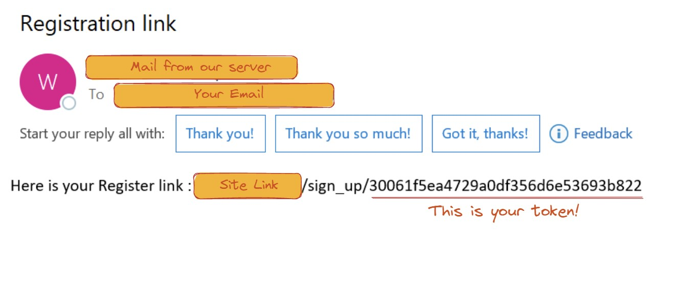
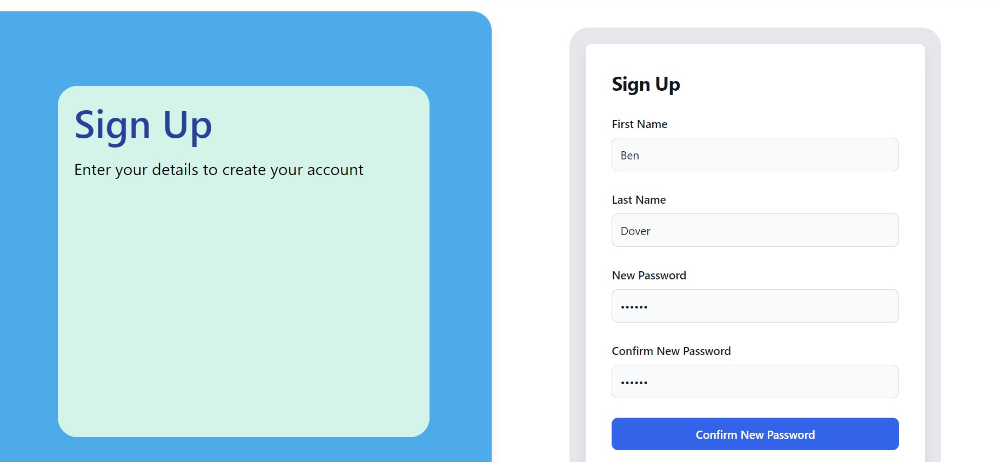

# Table of Contents
[[_TOC_]]

# Authors and Support
Members  
Naral Chalermchaikosol - 2783720c@student.gla.ac.uk  
Max Wang - 2561238w@student.gla.ac.uk  
Vaughn Muirhead - 2575235m@student.gla.ac.uk  
Binhao Li - 2534558l@student.gla.ac.uk  
Prith Manickam - 2518533m@student.gla.ac.uk  
Hugo Findlay - 2554911f@student.gla.ac.uk  

Team Coach  
Tim Storer - Timothy.Storer@glasgow.ac.uk


# AutoAssign - Project Summary
Auto-Assign is a React-Django-based website to automatically allocate graduates into teams for a 2-year graduate programme. The types of users that would use the website are Graduates, Managers, and HR.

## Visuals

Depending on what you are making, it can be a good idea to include screenshots or even a video (you'll frequently see GIFs rather than actual videos). Tools like ttygif can help, but check out Asciinema for a more sophisticated method.

## Links
- ER Diagram: https://gla-my.sharepoint.com/:u:/g/personal/2575235m_student_gla_ac_uk/EYP84zhmkexCrAAsUlQMdy8BEKsUjhI-rGA96Qrc9Q0Yzg?e=GZfZoZ  
- Figma (Wireframes): https://www.figma.com/file/AH6i7Z9b0IayMIizR5B4XR/Final-Frontend-Prototype?node-id=0%3A1


## Badges

On some READMEs, you may see small images that convey metadata, such as whether or not all the tests are passing for the project. You can use Shields to add some to your README. Many services also have instructions for adding a badge.

## Project status

If you have run out of energy or time for your project, put a note at the top of the README saying that development has slowed down or stopped completely. Someone may choose to fork your project or volunteer to step in as a maintainer or owner, allowing your project to keep going. You can also make an explicit request for maintainers.

## Roadmap / Releases

### Release 0.1 – November 30th 2022 
-	Repo at this stage: https://stgit.dcs.gla.ac.uk/team-project-h/2022/sh23/main/-/tree/e6444f97d4ca3fe31c020fa5479ca0eebc1296c8
-	Notes: Frontend and Backend not connected. Only Frontend UI is usable through routing.
-	New Features
	- Navbar: displaying Logo, AutoAssign Name, Avatar Icon
	- Login Page with no authentication
	- Forgot Password Page
	- Accounts Page: Contact details page
	- Graduate Account: Preference form page
-	Known Bugs
	- Avatar and Sign-out button shown in unauthenticated screens

### Release 0.2 – January 17th 2022 
-	Repo at this stage: https://stgit.dcs.gla.ac.uk/team-project-h/2022/sh23/main/-/tree/ea2c5f1bc43492f90baef1c63e4691d7967b370e
-	Notes: Frontend and Backend not connected. Only Frontend UI is usable through routing.
-	New Features
	- New Graduate Account Pages: View Teams Page
	- Manager Account: Homepage, Manage Teams page, Team Preference Settings page
	- HR Account: Homepage, View Teams, Assign Graduate page, Remove Graduate page, Assign Manager page, Remove Manager page
-	Known Bugs
	- Avatar and Sign-out button shown in unauthenticated screens

### Release 0.3 – February 15th 2023
-	Repo at this stage: https://stgit.dcs.gla.ac.uk/team-project-h/2022/sh23/main/-/tree/8e135fe7f3f6ad3ce597c8881c3bbe895a12786d 
-	Notes: Frontend and Backend not connected. Only Frontend UI is usable through routing.
-	New Features
	- Light/Dark mode toggled from navbar for all pages
	- Change Password Page navigated from Accounts Page side-navbar
	- New HR Account Pages: Auto-Assign pop-up, Create an Account page which also has functionality to swap specific grads from year 1 and 2, as well as mass shift all year 1 grads to year 2.
-	Known Bugs
	- Avatar and Sign-out button shown in unauthenticated screens on Navbar
	- Repeated placeholder for Avatar icon in Navbar

### Release 1.0 – March 17th 2023
-	Notes: Frontend and Backend are connected, and all features are fully functional.
-	New Features:
	- Login Page is now Authenticated
	     - When a user is logged in, pressing the AutoAssign logo takes you to their respective homepage.
	     - Visiting an unauthorised URL takes you back to the login page
	- User Password can be changed from Change Password Page
	- New HR Account Pages: Create Graduates Accounts page, Create Manager Accounts page, Delete Team page, Auto Assign Page
	- Manage Team Page now has a component to create a team.
	- AutoAssign page can view all unassigned graduate and manager accounts. They can choose to auto assign but will be warned if total team capacity create is too big or small.
	- When HR creates an account, an email would be sent to them with a unique link to a registration page
-	Known Bugs
	- No known bugs


# User Guide

## Installation
A full list of dependancies can be seen in [requirements.txt](AutoAssign/requirements.txt)

### Automated
<b>NOTE: Tested on Linux and MacOS. Automated installation does not work on windows as the library required to implement it is not secure. </b>
1) Run [install.py](AutoAssign/install.py) found inside [AutoAssign](AutoAssign/)

### Manual
1) First install all dependancies using: ```pip install -r requirements.txt``` inside [AutoAssign](AutoAssign/)

#### Django
2) Create the database by running the following commands inside [AutoAssign](AutoAssign/):  
- ``` python3 manage.py makemigrations ```  
- ``` python3 manage.py migrate ```
- ``` python3 populate.py ```
- Try replacing ```python3``` with ```py``` if the above steps do not work

#### React
3) Setup React using: ```npm install``` inside [client](client/)

## Usage

### Automated
<b>NOTE: Tested on Linux and MacOS. Automated startup does not work on windows as the library required to implement it is not secure. </b>
1) Run [startup.py](AutoAssign/startup.py) found inside [AutoAssign](AutoAssign/)

### Manual
1) Start the backend server with: ```python3 manage.py runserver``` inside [AutoAssign](AutoAssign/)

2) Then, start the fronted server with: ```npm run dev``` inside [client](client/)

3) Finally, open the URL provided by the frontend server, usually [http://localhost:5173](http://localhost:5173)

## Front-end Notes (If you've just cloned the project)
### List of Useful Commands (`cd client` first!)
1. `npm run start` to start both front and backend
1. `npm run dev:watch` to start only frontend + run linting and tests at start
1. `npm run dev` to start only frontend
1. `npm run test` to run frontend tests
1. `npm run lint` to run frontend linting/styling enforcement
1. `npm run build` to build the project (can be used for manual deployment) 

## Useful Tutorials/Documentations
1. React/TypeScript
    > https://youtube.com/playlist?list=PLNqp92_EXZBJ4CBroxVBJEpAXoz1g-naZ
    > https://youtu.be/z8lDwLKthr8  
    > https://youtu.be/Z5iWr6Srsj8  
2. MobX
    > https://youtu.be/nGZCL6Wd_zQ  
3. Tailwind CSS
    > https://youtu.be/UBOj6rqRUME  
4. Other Documents
    > https://www.typescriptlang.org/docs/handbook/react.html  
    > https://tailwindcss.com/docs/utility-first  
    > https://nerdcave.com/tailwind-cheat-sheet  
    > https://mobx.js.org/README.html  


## Steps to generate a skeleton project with `React, TypeScript, Tailwind`

### Prerequisites
- Code editor of your choice (VSCode/Webstorm)
- Node.js
- NPM (Node Package Manager)
    > Installing Node.js + NPM: https://youtu.be/JcwHHpim-CY

### Generating a `React + TypeScript` skeleton project 
1. `npm install vite@latest`
1. `npm create vite@latest` then enter your project name
2. Navigate down to React -> TypeScript
3. `cd {your_project_name}`
4. `code .` (to open up VSCode in that directory)
5. `npm install`
6. `npm run dev` (to check if it works)


### Installing `Tailwind`
1. Install `PostCSS Language Support` extension on VSCode
1. `npm install -D tailwindcss postcss autoprefixer`
2. `npx tailwindcss init -p`
3. Your `tailwind.config.js` should look like this:
``` 
/** @type {import('tailwindcss').Config} */
module.exports = {
  content: ["./src/**/*.{js,jsx,ts,tsx}"],
  theme: {
    extend: {},
  },
  plugins: [],
}
```
4. Put 👇 in all .css files, since we're writing Tailwind CSS
```
@tailwind base;
@tailwind components;
@tailwind utilities;
```
5. If you're playing around with the skeleton and Tailwind doesn't seem to work — make sure to wipe all generated CSS from `App.css` and `Index.css`

### Recommended Extensions for VSCode 
- `HTML CSS Support`
- `ES7+ React/Redux/React-Native snippets`
- `JavaScript and TypeScript Nightly`
- `Tailwind CSS IntelliSense`
- `Path Intellisense`
- `Live Share`
- `Live Server`

### Frontend Deployment Notes
- Login to/Signup for a Netlify account
- `ntl` and connect to your desired Netlify hosting repo
- `npm run build`
- `ntl deploy`
- `ntl deploy --prod`
- Make a new file under /public called `_redirects` with `/* /index.html 200` inside it
## General features for all users
Login Page:
- On the right side of the login page, there is a “Sign in to your account” interface. You can enter your email address and your password to log in.
- On the bottom right of the password input there is a 'forgot password' button, this will take you to a separate page where you can reset your password.

Forgot Password Page:
- On the right side of the page is an input box where you can input the email address attached to your account.
- This will send a password reset link to your email account, click on the link in the email.
- This will take you to a webpage, enter your new password in both boxes and click the submit button.
- You can now log in with your new password.

Light/Dark Mode:
- On the right side of the top navigation bar, you will find the icon of the sun, click on it to switch between light and dark mode.

Accounts Page (after logged on):
- Click the avatar icon in the top navigation bar to go to the accounts page interface. It will take you to the contact details subpage by default and can edit you first and last name by clicking the edit button.
- You can go to the change you password subpage by clicking on the section in the sidenav bar. You can change you password by entering your current password and your new password twice.

## User: Graduate
-	You will be sent an e-mail to your company account asking you to register.
-	You must provide your name, and create a password.
-	After you have created your account, you will be able to log in, where you have two choices, Skills Preference Form and Your Team.

- Skills Preference Form
	- The Skills Preference Form page will allow you to express which technologies you have experience and interest in.
	- You can select as many technologies as you want from the searchable dropdown lists
	- Make sure all fields are filled in.
	- No duplicate technologies are not allowed
	- When you are finished, press save to make sure that the data is correctly stored

- Your Team
	- This page lets you view a list of all the current members of your team
	- It shows a table containing their full name and e-mail adress

## User: Manager

-	You will be sent an e-mail to your company account asking you to register.
-	You must provide your name, and create a password.
-	After you have created your account, you will be able to log in, where you have two choices, Team Settings and Your Team.

- Team Settings 
	- The Team settings page will allow you to select which technologies you would like team members to be interested in.
	- Also on this page is a slider which will let you decide how much you want to prioritse a graduate's prior skill or enthuseasm to learn.
	- You can select as many technologies as you want from the searchable dropdown lists
	- When you are finished, press save to make sure that the data is correctly stored

- Your Team
	- This page lets you view a list of all the current members of your team
	- It shows a table containing their full name and e-mail adress


## User: HR

-	You would be given an account with email and password by the developers to log on.
-	Once you log on you will see 9 landing buttons to take to do different functions.
-	Manage Teams Page
	- You can view all teams where each are laid out in rows of rectangular icons which contains the details: team name, department name, Manager name & email, and team capacity
	- If you click on one of the teams, it shows a list of all graduates that are within it.
-	Delete Team Page
	- Click the dropdown or type to search to view all teams that are created which show the team’s name, department name, manager name, and user capacity in one line.
-	Assign Graduate
	- Click the dropdown or type to search to view all graduate emails, and the team’s name & department name you want to assign the graduate to.
-	Remove Graduate
	- Click the dropdown or type to search to view all graduate accounts as emails that you want to delete permanently.
	- Below this there is also an option to view all the year 2 graduates, and mass delete all of them (when the second year rotation/the graduate program is finished for them)
-	Assign Manager
	- Click the dropdown or type to search to view all manager emails, and the team’s name & department name you want to assign the manager to. This would either replace the current manager for that team or assign a new one to a team that is unassigned a manager (when you delete that managers account).
-	Remove Manager
	- Click the dropdown or type to search to view all graduate accounts as emails that you want to delete permanently.
-	Create Graduate Account
	- Use the top component type one or multiple emails of new graduates. They would get an email to register (more information in User Registration). 
	- There are two tables below it showing all graduates that are in year 1 or year 2. All the new graduates would be moved to the year 1 table. There is also a button to shift all year 1 grads to year 2 (when the rotation for year 1 is over).
-	Create Manager Account
	- Use the top component type one or multiple emails of new graduates. They would get an email to register (more information in User Registration). 
	- There is a table to view all managers.
-	Auto Assign Page
	- You can view the total number of graduates created, and the total team capacity. There is AutoAssign button which would display red and show a warning if team capacity is too low or too high, and it would display green if the team capacity is equal to total number of grads. When the button is clicked it would automatically assign all graduates to teams (where you can view them by clicking on each team in the Manage Teams Page.
	- This page also shows a table of unassigned graduates and managers before and after pressing AutoAssign.
-	How the AutoAssign Algorithm works

## User Registration after HR creates an account
- You will receive an email which prompts you with a sign up link. It should look like this:

- Following the link—you will be redirected to our sign up page.

- Enter your credentials. There will be a notification on the top right to let you know if successful or not.
- If successful, you will be redirected bacak to the log in page. Use your previously submitted credentials.

# Contributing

State if you are open to contributions and what your requirements are for accepting them.
For people who want to make changes to your project, it's helpful to have some documentation on how to get started. Perhaps there is a script that they should run or some environment variables that they need to set. Make these steps explicit. These instructions could also be useful to your future self.
You can also document commands to lint the code or run tests. These steps help to ensure high code quality and reduce the likelihood that the changes inadvertently break something. Having instructions for running tests is especially helpful if it requires external setup, such as starting a Selenium server for testing in a browser.


# License

MIT License: https://stgit.dcs.gla.ac.uk/team-project-h/2022/sh23/main/-/blob/main/LICENSE


